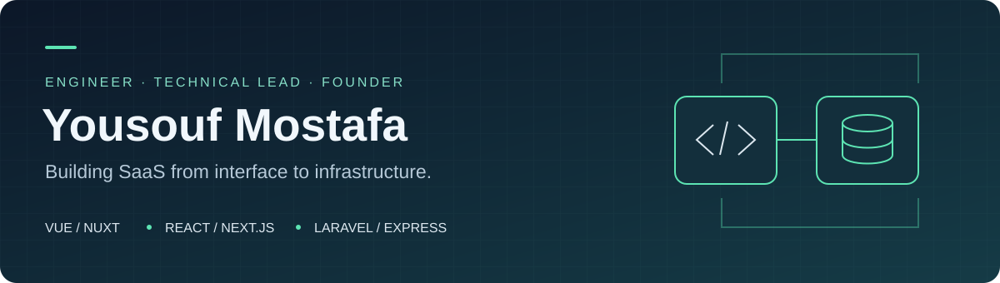
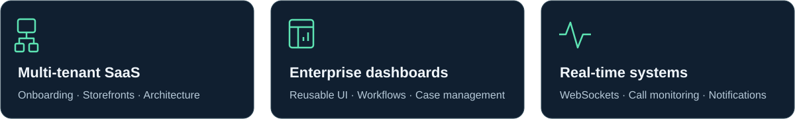

# Hi, I'm Yousouf Mostafa

### Full Stack Engineer · Technical Lead · Founder of Dokio

I build SaaS platforms, enterprise dashboards, and e-commerce applications. My work combines frontend engineering with backend development, with a focus on multi-tenant architecture, reusable interfaces, and maintainable systems.

## About me

- **5+ years of experience** building web applications across e-commerce, legal services, call centers, education, and enterprise software.
- **Founder of Dokio**, a multi-tenant e-commerce SaaS platform built with Laravel, Vue 3, and Nuxt 4.
- **Technical Lead at Loctech** and **Senior Full Stack Developer at Wakeb Data**.
- I translate business requirements into technical plans, mentor developers, and help teams modernize existing applications.
- My strongest frontend experience is in **Vue and Nuxt**, alongside **React and Next.js**, with **Laravel and Express.js** on the backend.

## Technical toolkit

<picture>
  <source media="(prefers-color-scheme: light)" srcset="https://skillicons.dev/icons?i=vue,nuxtjs,react,nextjs,ts,js,php,laravel,express,tailwind,pinia,firebase,docker,githubactions,git,figma&amp;perline=8&amp;theme=light" />
  
</picture>

| Area | Technologies |
| :--- | :--- |
| Languages | JavaScript, TypeScript, PHP, HTML, CSS |
| Frontend | Vue 2/3, Nuxt 2/3/4, React, Next.js |
| Backend and APIs | Laravel, Express.js, REST APIs, Firebase Authentication, Firestore |
| UI and state | Tailwind CSS, Vuetify, Nuxt UI, PrimeVue, Sass, Pinia, Vuex |
| Forms and validation | VeeValidate, Zod, React Hook Form |
| Real-time and web platforms | WebSockets, SIP/VoIP, Firebase Cloud Messaging, Service Workers, PWA, SSR |
| Delivery and quality | Git, GitHub Actions, Docker, CI/CD, unit testing, TDD, Core Web Vitals |
| Design and collaboration | Figma, Agile/Scrum, code reviews, technical documentation |

## Featured work

### [Dokio — E-commerce SaaS](https://dokio.shop/)

A multi-tenant platform connecting vendor administration, automated onboarding, and server-rendered storefronts.

- Built the e-commerce engine with **Laravel, Vue 3, and Nuxt 4**.
- Automated store subdomain provisioning through an event-driven registration workflow.
- Used hostname-based tenant resolution and Nuxt SSR to serve tenant-specific storefront content.
- Developed the vendor dashboard and store management interface.

### Saudi Law Firm Platform

A legal services platform built with **Next.js, Express.js, Zod, and React Hook Form**.

- Led delivery of a landing page based on Framer designs.
- Improved the landing page performance score from **24 to 85** through Core Web Vitals optimization.
- Configured Docker deployment and integrated Mailjet for form submission feedback.
- Resolved administrative dashboard layout and performance issues.

### Legal and Consultation SaaS Dashboard

A government-focused dashboard built with **Vue 3, Pinia, and Vuetify**.

- Organized the application around a feature-based architecture.
- Developed legal case management, Kanban tasks, and project management modules.
- Created two product themes and implemented interfaces aligned with Figma designs and business requirements.

<strong>Explore more projects</strong>

### Defense Development Authority Landing Portal

**PHP · Blade**

Refactored the portal, aligned the interface with DGA accessibility requirements, and implemented the frontend for feedback and contact forms.

### Call Center Dashboard

**Vue 3 · TypeScript · WebSockets · Tailwind CSS**

Improved real-time agent monitoring in the Live Panel. Developed Sound on Hold, scheduled reports, scheduled alerts, and AI analysis report features, plus contact pages with chat-style notes.

### Base Conference — Multi-Tenant SaaS

**Nuxt 3 · TypeScript · Pinia · Tailwind CSS**

Built a shared codebase for multiple conference websites, with dynamic interfaces and JSON-driven form components. Created technical documentation, data flow diagrams, and team walkthroughs.

### Cashiern POS System

**Vue 2/3 · Vuetify · Sass**

Led the migration to Vue 3 Composition API, established CI/CD and TDD practices, and onboarded a development team. Delivered product, category, product trait, offer, and inventory management features.

### Doworkss Freelance Platform

**Vue 2 · Vuex · Sass**

Built homepage search, blogs, service listings, and provider pages. Implemented a global filter sidebar and improved the homepage experience.

### Alroaa Academy PWA

**Nuxt 2 · Pinia · Tailwind CSS · Firebase**

Designed the interface in Figma and built a mobile-friendly progressive web app using Firebase Authentication and Firestore as the backend.

## How I work

I start by understanding the business requirements and mapping them to clear application boundaries. I build reusable components where they reduce duplication, document the decisions that matter, and use code reviews and testing to support maintainable delivery.

I also work closely with clients, designers, and backend teams to keep implementation aligned with the product requirements.

## Let's connect

For conversations about SaaS architecture, frontend engineering, or technical collaboration, reach me on [LinkedIn](https://www.linkedin.com/in/yousouf-essa-7029531b7/) or by [email](mailto:yousoufmostafamuslim@gmail.com).

Technology icons by [Skill Icons](https://github.com/tandpfun/skill-icons). Badges by [Shields.io](https://shields.io/).
